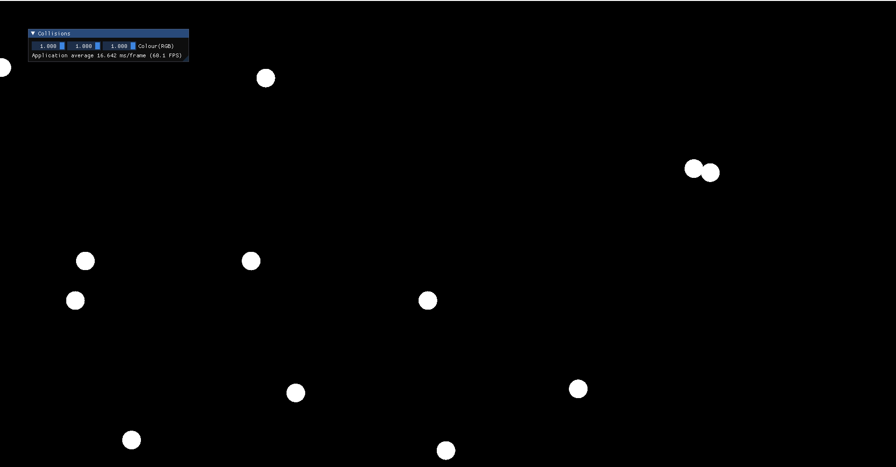

# CollisionSimulation
This is a billard balls collision simulator implemented in C++ using Opengl 



## Packages used 
```
- GLFW
- glew
- glm
- Imgui
- stb_image
```
## Issues still to be solved
```
- Collision between more the 2 balls will cause a glitch.
- Slow with a lot of balls due to collision detection and need to implement:
	- Sweep and prune algorithm or
	- Space partioning - Uniform grid partioning or K.D. Trees or
	- Object partioning using bounding volume hierachies
- Need to improve Collision response.
- If balls move fast enough then balls can pass through each other.
- When a ball is between a wall and a ball can cause glitches.
```